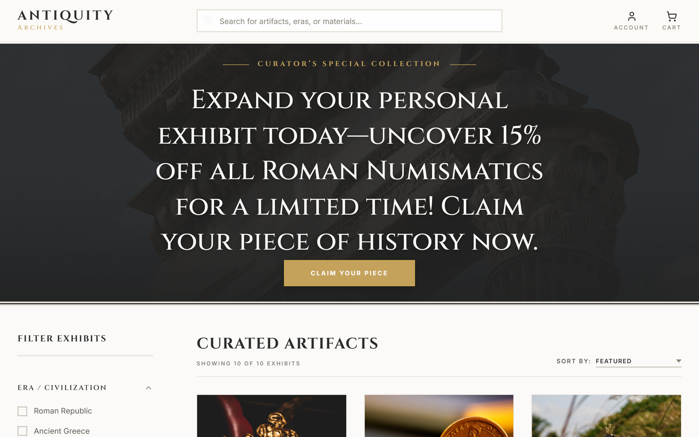

# Antiquity Archives E-commerce Prototype

Welcome to the **Antiquity Archives E-commerce Prototype**. This project is a modern, responsive React web application that showcases a curated collection of historical artifacts. It provides an intuitive browsing experience with robust filtering, smooth scrolling, and a complete multi-step checkout flow.

## 📸 Screenshots

### Storefront & Curated Artifacts


*(You can capture more screenshots and place them in the `public/` directory, then update these links!)*

## 🚀 Features

- **Dynamic Storefront**: Browse historical artifacts using responsive product cards.
- **Advanced Filtering & Sorting**: Filter items by era, category, material, and maximum price. Sort by featured, price, or name.
- **Search**: Quickly find specific artifacts by name, description, era, or category.
- **Smooth Navigation**: Click "Claim Your Piece" in the hero banner to smoothly scroll to the product list.
- **Shopping Cart**: Add, remove, and adjust the quantity of items directly from the catalog.
- **Quick View & Modals**: View product details quickly without leaving the current page.
- **Multi-Step Checkout**: A beautifully designed checkout flow encompassing Cart, Shipping Details, Secure Payment, and Order Confirmation.
- **Post-Purchase Survey**: A styled, interactive modal collecting user feedback.

## 🛠 Technology Stack

- **React 19**: Modern UI component architecture.
- **Vite**: Ultra-fast development server and optimized build tool.
- **Vanilla CSS**: Custom styling with CSS Variables, Flexbox, and Grid for a highly tailored aesthetic and animations.

## ⚙️ Getting Started

### Prerequisites

- Node.js (version 18+)
- npm or yarn

### Installation & Running Locally

1. **Install dependencies:**
   ```bash
   npm install
   ```

2. **Start the development server:**
   ```bash
   npm run dev
   ```

3. **Open the application:**
   Navigate to [http://localhost:5173](http://localhost:5173) in your browser.

## 📝 Usage

- Browse the collection and try out the sidebar filters to find specific artifacts.
- Adjust quantities in the cart or on the product cards.
- Complete a test checkout process to see the different steps.

---

*Developed for SEG3125 - Assignment 4.*
